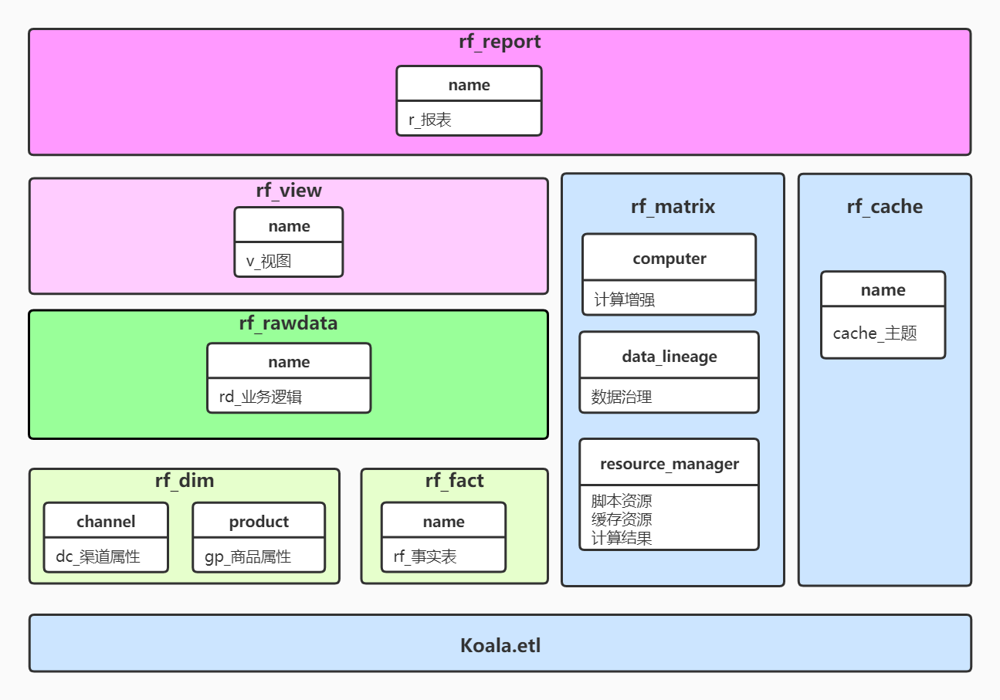

# 系统建设-功能总线-报表开发
> 数据中心
********

### 1.定义
通用数据报表开发架构和组件

### 2.架构

### 3.组件
#### 基础组件
- **基础ETL: koala.etl**, 数据加载处理输出
- **报表支持: rf_matrix**: 计算增强, 资源管理, 任务管理
- **调度: rf_bin**: 定义job
- **缓存数据: rf_cache**: 数据缓存

#### 报表组件
- **维度属性: rf_func.dim**: 在主表或最终报表上添加属性和其他提高报表可用性的标签
- **事实表: rf_func.fact**, 获取指标
- **主表: rf_func.rawdata**, 定义数据粒度和基础指标, 实现业务逻辑
- **展示模板: rf_func.view**: 常用汇总模板

#### 报表输出
- **报表实体: rf_report**: 定义报表数据流
- **报表生成: rf_bin**: 定义job