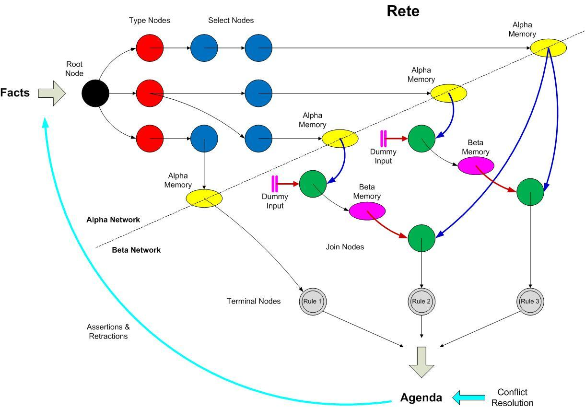

# 规则引擎
> 基于Python+Pandas的规则执行器
********
### Rete算法
#### 事实 fact
> identifier ^ attribute  value (实体属性的值)

#### 模式 patten
> 最小条件
#### 规则 rule
> LHS: 条件部分(conditions) left-hand side
> RHS: 结论部分(actions) right-hand side

#### 算法 rete

