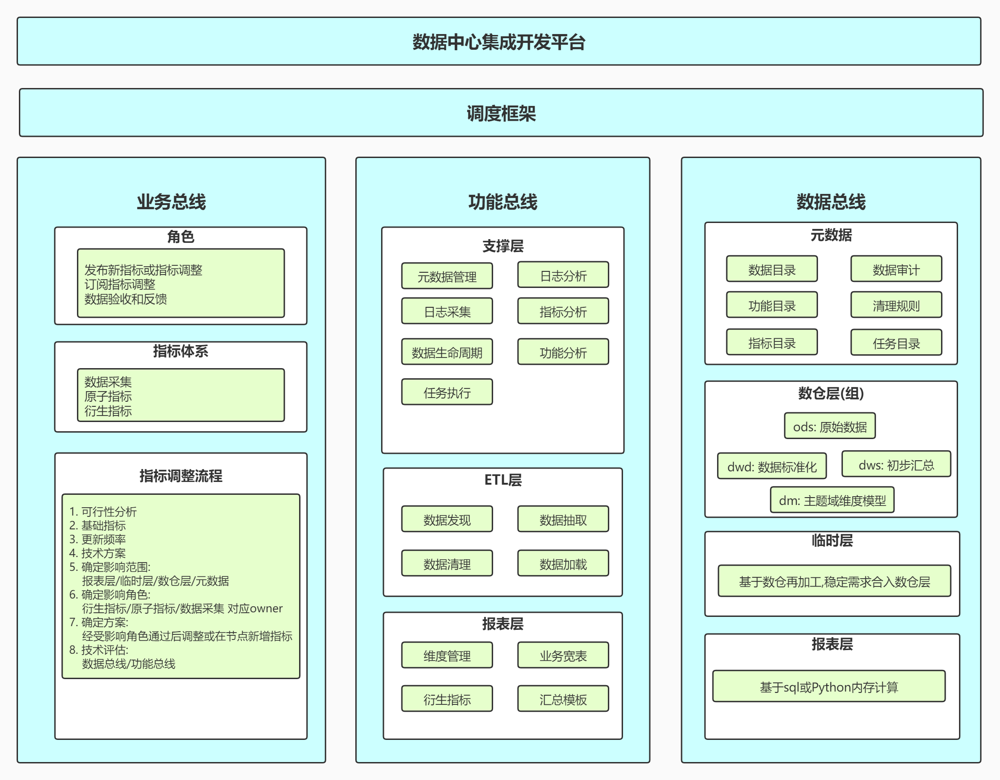

# 三: 数据中心
> 数据中心
********

### 1.系统分析
- 系统目标: 可柔性开发扩展的数据中心集成开发平台
- 系统功能
    - 业务总线: 由业务驱动对异构数据资源进行探索开发到报表
    - 数据总线: 由数据驱动对历史业务需求进行抽象整合到数仓
    - 功能总线: 以task为最小单元支撑以上两大模块
- 长期功能: 
    - 将业务分析成果沉淀到数据总线
    - 将业务处理逻辑沉淀到功能总线
    - 技术能力沉淀到功能总线

### 2.整体架构

### 3.技术框架

- 数据存储: MySQL, ColumnStore, ClickHouse
- ETL支持: Kettle, Python, SQL, DataX
- 工作流与任务调度: apache-airflow, celery

